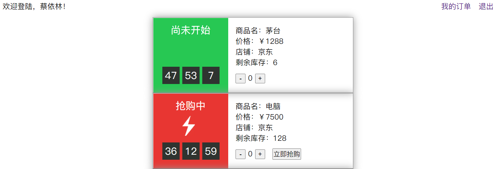
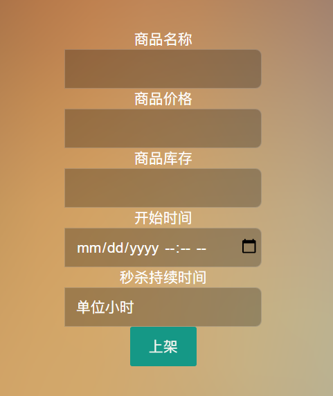

# flash_sale_system
互联网开发作业，商品秒杀系统，，，

#### 一、部署说明

##### 1. 导入数据库

将`数据库/shop.sql`导入自己的数据库。

##### 2. 前台

requirements: PHP 5.6

在以下文件对应地方，定义数据库的密码。

|  文件   | 行数  |
|  ----  | ---- |
| `api/dologin.php` | 7 |
| `api/kill.php` | 24, 54, 76 |
| `api/get_valid_item.php` | 7 |
| `myorder.php` | 46, 15 |

之后将`前台（用户端）`下的文件拷贝到服务器，直接访问`index.php`即可。

##### 3. 后台

requirements: ThinkPHP 5.0, PHP 5.6

新建一个ThinkPHP 5环境，将`后台（商家端）/`下的文件拷贝到服务器，在`tp5根目录/application/database.php`文件中定义第一步设置的数据库地址，即可通过访问`index`模块进入系统。

#### 二、测试账号
|  | 用户名 | 密码 | 备注  |
|  ----  | ---- | ---- | ---- |
| 前台 | 蔡依林 | 123456 | 买家 |
| 后台 | admin  | admin  | 管理员 |
| 后台 | 京东 | 123321 | 商家 |
